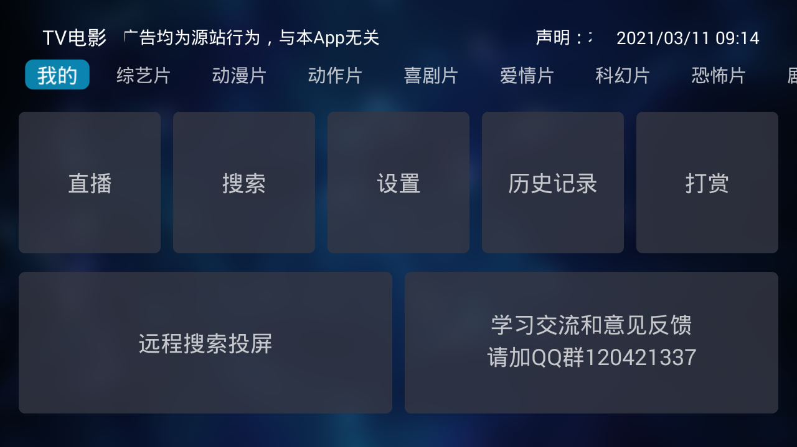
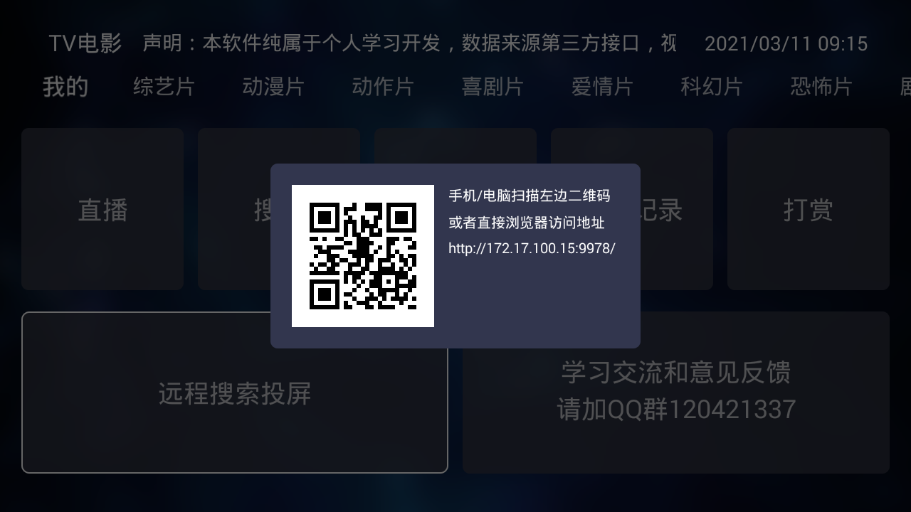
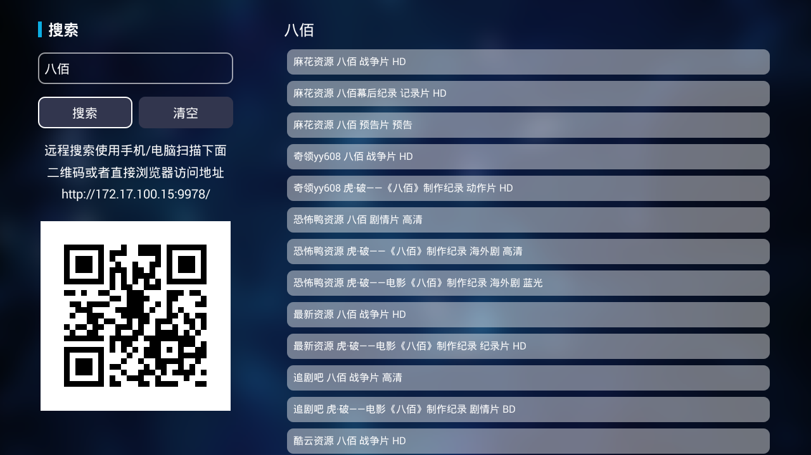
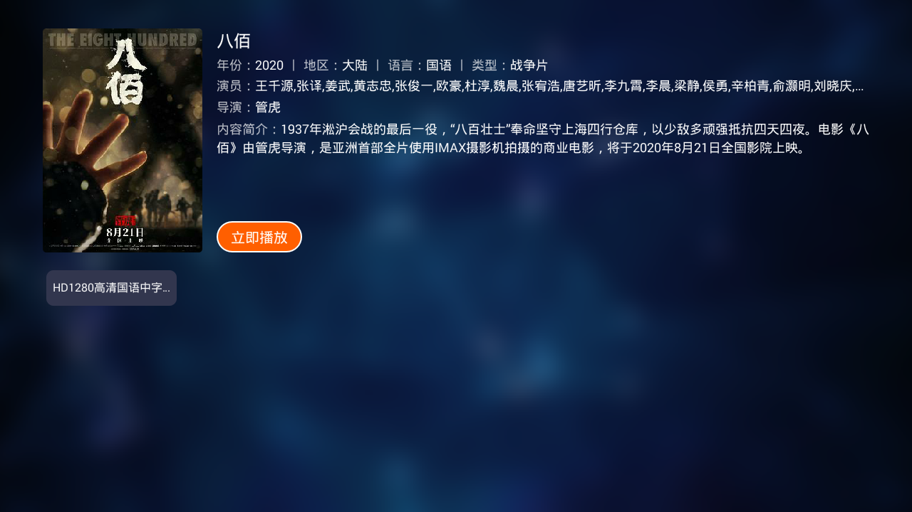
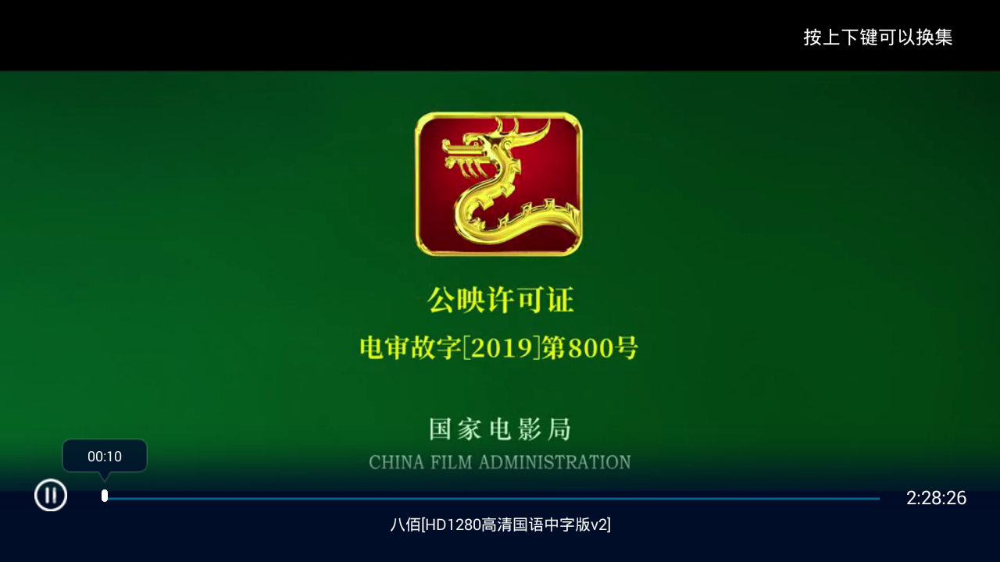
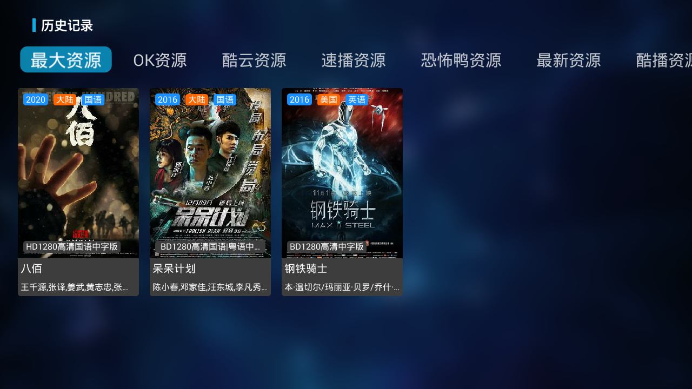

# TVMovie
支持手机版了，百度云盘下载体验新版本、AndroidTV、机顶盒、电影、电视剧、直播、远程搜索、远程网页投屏解析；喜欢的大家给个star，谢谢！QQ交流群(120421337(已满)、544929943、122649401)

## 应用截图后面会更新截图

###版本说明
1.3.0版本
    低于6.0版本不启动投屏功能
1.2.8版本
    新增直播功能；
    新增投屏功能；
    兼容部分资源获取；
    优化资源播放；
1.2.6版本
    部分bug修复；
    修改应用图标和应用名字
1.2.4版本：
    项目重构；
    搜索支持首字母；
    功能兼容手机；
    添加收藏；
    支持自定义源；
1.2.3版本：
    优化历史记录；
    搜索改成单个数据源同步搜索；
    部分功能优化；

### 重构版本体验下载链接：
- [1.3.0 百度网盘下载](链接：https://pan.baidu.com/s/1YqvIHTeOippDyr1ijv8YWQ)，提取码: p0u8 

### 重要说明:
所有资源来自网上, 该软件不参与任何制作, 上传, 储存, 下载等内容. 该软件仅供学习参考, 请于安装后24小时内删除.